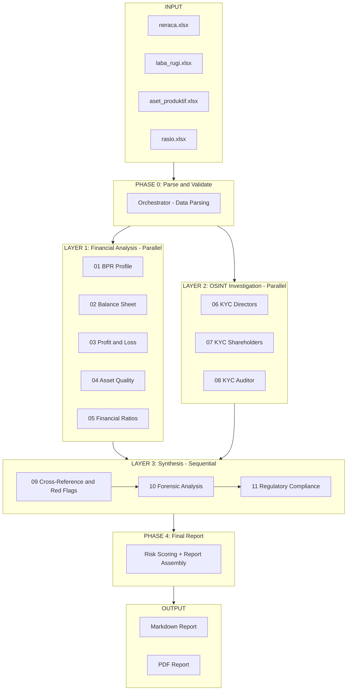
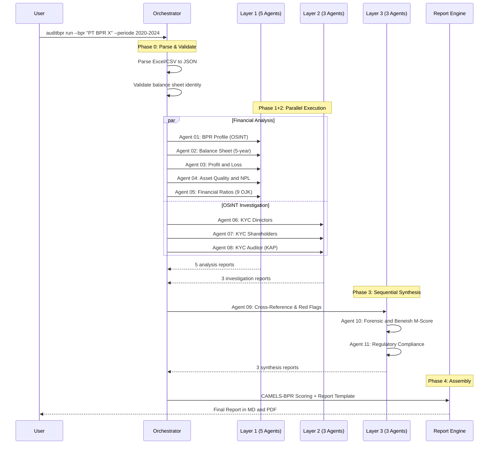
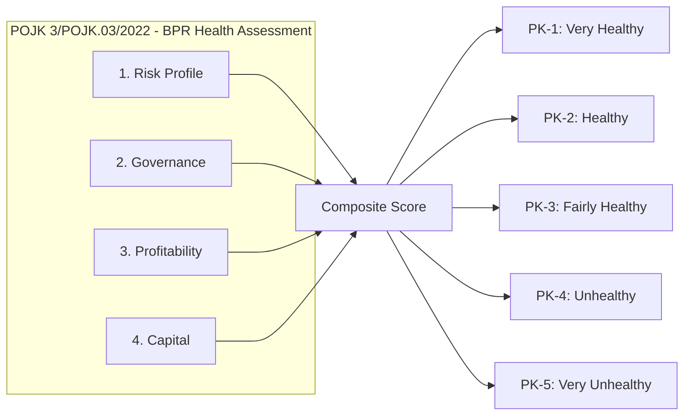
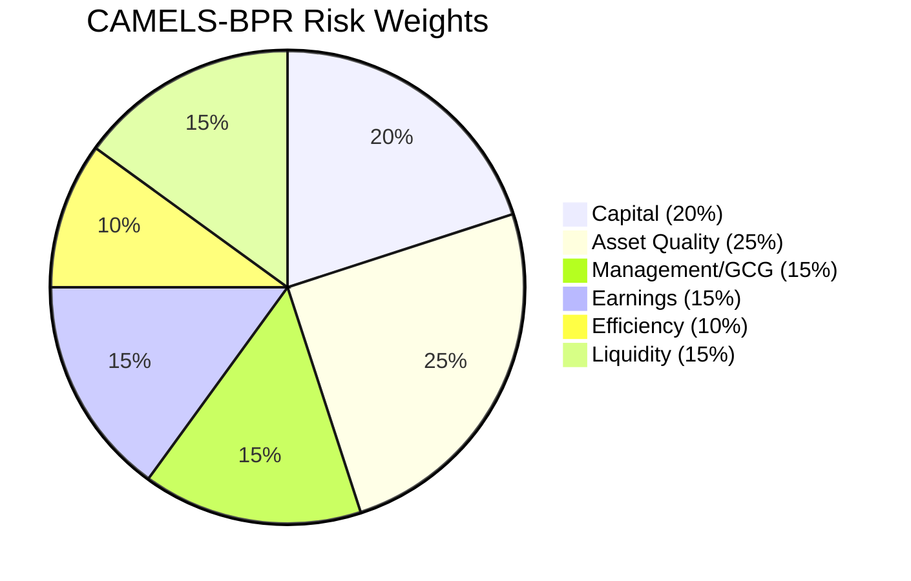

<div align="center">

# 🏦 AuditBPR

### AI-Powered Multi-Agent Audit & Investigation System

**for Bank Perkreditan Rakyat (BPR) Indonesia**

[](https://www.npmjs.com/package/auditbpr)
[](LICENSE)
[](https://nodejs.org)
[](#-supported-platforms)

> Orchestrates **12 AI agents** to produce comprehensive BPR audit reports covering
> financial analysis, OSINT investigations, forensic accounting, and regulatory compliance.

</div>

---

## 📐 System Architecture



---

## 🔄 Execution Flow



---

## 🚀 Quick Start

### Install
```bash
# Install globally
npm install -g auditbpr

# Or run directly with npx
npx auditbpr info
```

### Usage
```bash
# 1. Initialize project
auditbpr init

# 2. Edit configuration
#    → Edit .auditbpr.json with your BPR data

# 3. Place financial data
#    → data/neraca.xlsx, data/laba_rugi.xlsx, etc.

# 4. Run audit
auditbpr run --bpr "PT BPR Nama" --periode 2020-2024

# 5. Generate PDF report
auditbpr report --format pdf
```

### Platform-Specific Runners
```bash
# Gemini CLI (Best for OSINT — 1M token context)
bash platforms/run_audit_gemini.sh

# Claude Code (Best for calculations — true parallelism)
bash platforms/run_audit_claude.sh

# Codex / OpenAI (Best for API integration — AsyncIO)
python platforms/run_audit_codex.py

# OpenCode (Flexible — any LLM)
opencode run --config platforms/opencode.config.json
```

---

## 📁 Project Structure

```
auditbpr/
├── bin/cli.js                          ← CLI entry point (npm)
├── src/                                ← CLI modules
│   ├── commands/init.js                ← auditbpr init
│   ├── commands/run.js                 ← auditbpr run
│   ├── commands/report.js              ← auditbpr report
│   ├── commands/info.js                ← auditbpr info
│   └── config.js                       ← Config management
│
├── SKILL.md                            ← Master prompt (all platforms)
├── orchestrator/SKILL.md               ← 4-phase coordinator
│
├── agents/                             ← 11 specialist agents
│   ├── 01_bpr_profile/                 ← BPR profile & reputation
│   ├── 02_neraca/                      ← Balance sheet (5 years)
│   ├── 03_laba_rugi/                   ← P&L analysis (5 years)
│   ├── 04_aset_produktif/              ← Asset quality & NPL
│   ├── 05_rasio_keuangan/              ← 9 OJK ratios + benchmarks
│   ├── 06_investigasi_pengurus/        ← KYC Directors
│   ├── 07_investigasi_pemegang_saham/  ← KYC Shareholders
│   ├── 08_investigasi_kap/             ← KYC Auditor firm
│   ├── 09_cross_reference_redflag/     ← Red flag detection
│   ├── 10_forensic_trend/              ← Beneish M-Score & forensics
│   └── 11_regulatory_compliance/       ← OJK/BI compliance audit
│
├── tools/                              ← Analysis tools
│   ├── financial_calculator.py         ← NPL, PPKA, CAR, M-Score
│   ├── excel_csv_parser.md             ← Data parsing schema
│   ├── web_search_deepresearch.md      ← 3-layer OSINT protocol
│   ├── markdown_renderer.md            ← Formatting standards
│   └── pdf_generator.md                ← MD → PDF conversion
│
├── templates/                          ← Report templates
│   ├── laporan_final_template.md       ← 10-chapter report template
│   ├── risk_scoring_matrix.md          ← CAMELS-BPR scoring
│   ├── red_flag_taxonomy.md            ← 15 red flags (Tier 1/2/3)
│   └── pdf_style.css                   ← PDF styling
│
├── config/                             ← Regulatory configs
│   ├── regulatory_thresholds.md        ← All OJK/BI thresholds
│   └── industry_benchmarks.md          ← BPR industry averages
│
├── platforms/                          ← Platform-specific runners
│   ├── run_audit_gemini.sh
│   ├── run_audit_claude.sh
│   ├── run_audit_codex.py
│   └── opencode.config.json
│
└── data/                               ← Input files (user-provided)
```

---

## 📊 Report Output

The system generates an **80–150 page** professional audit report:

```
 CHAPTER I     Executive Summary & Risk Score
 CHAPTER II    BPR Profile & Digital Reputation
 CHAPTER III   5-Year Financial Analysis
               ├── Balance Sheet (Position)
               ├── Profit & Loss (Performance)
               ├── Productive Asset Quality
               └── Financial Ratios (9 OJK metrics)
 CHAPTER IV    Governance Investigation
               ├── Directors & Commissioners (OSINT)
               ├── Shareholders & Beneficial Owners
               └── External Auditor (KAP)
 CHAPTER V     Critical Findings & Red Flag Matrix
 CHAPTER VI    Forensic & Trend Analysis (M-Score)
 CHAPTER VII   OJK/BI Regulatory Compliance
 CHAPTER VIII  Risk Scoring Matrix (CAMELS-BPR)
 CHAPTER IX    Recommendations & Audit Opinion
 CHAPTER X     Appendix & Data Sources
```

---

## 🔍 Analysis Capabilities

### 📈 Financial
- 5-year trends: assets, loans, deposits, profitability, efficiency
- Independent verification of **9 OJK ratios** from raw financial data
- PPKA adequacy & adjusted CAR after provision shortfall
- BMPK check (related-party loans vs. capital)
- Benchmarking against national BPR industry averages

### 🔬 Forensic
- **Beneish M-Score** adapted for BPR (8 components)
- **Window dressing detection** (5 methods)
- Cross-report anomaly correlation
- 3-scenario stress test + capital buffer analysis
- Base Case & Worst Case projections for T+1, T+2

### 🕵️ KYC / OSINT Investigation
- 28 queries per executive: legal, business, social media, SLIK, PPATK
- Beneficial owner tracing (down to natural persons)
- KAP independence analysis: tenure, affiliations, PPPK track record
- Network mapping: hidden connections between executives–shareholders–KAP
- Detection of **5 fraud patterns**: tunneling, zombie BPR, deposit ponzi, window dressing, shell bank

---

## ⚖️ Regulatory Framework

### BPR Health Assessment (Tingkat Kesehatan BPR)



> **Note:** Since POJK 3/2022, OJK has transitioned from the traditional CAMELS scoring to a
> **4-factor risk-based approach** (Risk Profile, Governance, Profitability, Capital).
> This system supports both frameworks — CAMELS-BPR for backward compatibility and the
> new 4-factor methodology per the latest regulation.

### Complete Regulation Coverage

| Category | Regulation | Aspects Checked | Status |
|----------|-----------|-----------------|--------|
| **Health Assessment** | | | |
| | POJK 3/POJK.03/2022 | 4-factor health assessment (Risk Profile, Governance, Profitability, Capital) | ✅ Current |
| | SEOJK 11/SEOJK.03/2022 | Technical guidelines for health assessment | ✅ Current |
| **Institutional** | | | |
| | POJK 7/2024 | BPR institutional framework (new nomenclature: "Bank Perekonomian Rakyat") | ✅ Latest |
| | UU 4/2023 (UU P2SK) | Financial Sector Development & Strengthening Law | ✅ Latest |
| **Capital** | | | |
| | POJK 5/POJK.03/2015 | CAR ≥ 12%, minimum paid-up capital per zone | ✅ |
| | POJK 12/POJK.03/2018 | Enhanced minimum capital requirements | ✅ |
| **Asset Quality** | | | |
| | POJK 1/2024 | Productive asset quality (replaces POJK 33/2018) | ✅ Latest |
| | POJK 33/POJK.03/2018 | NPL ≤ 5%, PPKA rates per collectibility | ✅ Legacy |
| | PBI 7/2/PBI/2005 | Collectibility classification criteria | ✅ |
| **Credit Limits** | | | |
| | POJK 49/POJK.03/2017 | BMPK: 10% related, 20% group, 30% non-related | ✅ |
| **Governance** | | | |
| | POJK 9/2024 | Corporate governance (replaces POJK 62/2020) | ✅ Latest |
| | POJK 62/POJK.03/2020 | Fit & Proper test, concurrent positions | ✅ Legacy |
| **Reporting** | | | |
| | POJK 23/2024 | Digital reporting via APOLO & financial transparency | ✅ Latest |
| | POJK 48/POJK.03/2017 | Transparency & report publication | ✅ Legacy |
| **Supervision** | | | |
| | POJK 28/2023 | Supervisory status & follow-up actions for BPR | ✅ Latest |
| **AML/CFT** | | | |
| | POJK 12/POJK.01/2017 | AML/CFT: CDD, EDD, STR, CTR to PPATK | ✅ |
| | UU 8/2010 | Money Laundering Prevention Law | ✅ |
| **External Audit** | | | |
| | PMK 154/PMK.01/2017 | KAP & AP licensing, rotation, independence | ✅ |
| **Data Protection & IT** | | | |
| | UU 27/2022 (UU PDP) | Personal Data Protection Law | ✅ |
| | UU 1/2024 (UU ITE rev.) | Electronic Information & Transactions (revised) | ✅ |
| | POJK 44/2024 | Bank Secrecy & confidentiality framework | ✅ Latest |
| | PERP LPS 4/2024 | SCV audit — Single Customer View data quality | ✅ Latest |
| **Consumer Protection** | | | |
| | POJK 22/2023 | Consumer & public protection in financial services | ✅ Latest |
| **Banking Law** | | | |
| | UU 7/1992 jo 10/1998 | Banking Law — prohibited activities, sanctions | ✅ |

---

## ⚙️ Supported Platforms

| Feature | Gemini CLI | Claude Code | Codex / GPT | OpenCode |
|---------|:----------:|:-----------:|:-----------:|:--------:|
| True Parallelism | ❌ Sequential | ✅ Subagents | ✅ AsyncIO | ⚠️ Limited |
| Google Search | ✅ Native | WebFetch | ✅ Tool | Plugin |
| Python Execution | Via bash | ✅ Bash tool | ✅ Code Interp | ✅ Terminal |
| Context Window | **1M token** | 200K | 128–200K | Varies |
| Setup Difficulty | 🟢 Easy | 🟢 Easy | 🟡 Medium | 🟢 Easy |
| **Best For** | **OSINT** | **Calculations** | **API/SDK** | **Flexible** |
| Est. Audit Time | 45–75 min | 25–40 min | 20–35 min | 30–60 min |

---

## 🧮 Risk Scoring Engine



| Score | Rating | Interpretation |
|------:|--------|----------------|
| 4.5–5.0 | ✅ **Very Healthy** | No special action needed |
| 3.5–4.4 | ✅ **Healthy** | Normal monitoring |
| 2.5–3.4 | ⚠️ **Fairly Healthy** | Intensive supervision |
| 1.5–2.4 | 🔴 **Unhealthy** | Immediate corrective action |
| 1.0–1.4 | 🚨 **Very Unhealthy** | Administrative sanctions |

> Red Flag penalties: Tier-1 (−0.5), Tier-2 (−0.3), Tier-3 (−0.1) per finding.

---

## 🚨 Red Flag Taxonomy

| Tier | Severity | Examples | Score Weight |
|------|----------|----------|:------------:|
| **Tier 1** | 🚨 Critical | Fictitious loans, massive insider lending, fund embezzlement, phantom capital, systematic window dressing | ×3.0 |
| **Tier 2** | 🔴 High | Excessive concentration, NPL > 5%, capital erosion, non-independent auditor, problematic management | ×2.0 |
| **Tier 3** | ⚠️ Medium | Declining efficiency, non-organic growth, data inconsistencies, weak governance | ×1.0 |

**5 Fraud Patterns Detected:**
1. **Tunneling** — Profits diverted via related-party bad loans
2. **Zombie BPR** — Kept alive by owners for illicit purposes
3. **Window Dressing** — Financial statements manipulated at period-end
4. **Deposit Ponzi** — Paying old depositors with new depositor funds
5. **Shell Bank** — Vehicle for parking related-party funds

---

## ⚠️ Disclaimer

This system is a professional tool for BPR audit and investigation.
Output is **indicative** and does not replace formal audits per IAPI/OJK
standards. OSINT investigations are based on publicly available information
and require official verification before being used as a basis for legal
or regulatory decisions. All financial data processing complies with
**UU PDP (Personal Data Protection)** and **UU ITE** requirements.

---

<div align="center">

**AuditBPR v1.0.0** — Built for stronger banking supervision 🇮🇩

[npm](https://www.npmjs.com/package/auditbpr) · [GitHub](https://github.com/digimetalab/auditbpr) · [Report Issues](https://github.com/digimetalab/auditbpr/issues)

</div>
